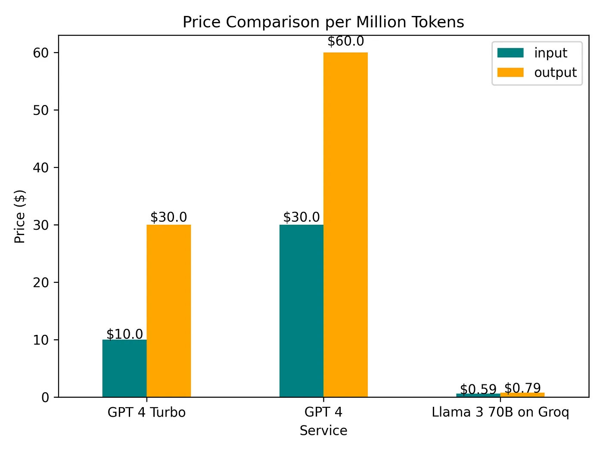

### Why Use Groq

Running GPT-4 on Groq is expensive, especially if you want to create a user-facing application that will need to handle a lot of requests.


### OpenAi vs Groq Cost Comparison

Cost per million tokens (input/output):



While Llama-3–70B is not as performant as GPT-4, the affordable pricing offered by Groq adds viability to many use cases, including Autogen experimentation.

### Using Groq with Autogen

Groq offers 'OpenAI Compatibility'. By mimicking the functionality of the OpenAI API, we can easily substitute Groq into our existing applications that are built on OpenAI without having to worry about changing schemas and API outputs.

Fortunately, this makes using Groq with Autogen very easy:

1. Create an API key for Groq
2. Set up the Autogen LLM config with Groq:

```python
llm_config = {
    "model": "llama3-70b-8192",
    "api_key": os.environ["GROQ_API_KEY"],
    "base_url": "https://api.groq.com/openai/v1/"
}
```

3. Run your agents with Groq!


``` python
import autogen
from autogen import AssistantAgent, UserProxyAgent
import os

llm_config = {
    "model": "llama3-70b-8192",
    "api_key": os.environ["GROQ_API_KEY"],
    "base_url": "https://api.groq.com/openai/v1/"
}

with autogen.coding.DockerCommandLineCodeExecutor(work_dir="coding") as code_executor:
    assistant = AssistantAgent("assistant", llm_config=llm_config)
    user_proxy = UserProxyAgent(
        "user_proxy", code_execution_config={"executor": code_executor}
    )

    # Start the chat
    user_proxy.initiate_chat(
        assistant,
        message="What date is today? Which big tech stock has the largest year-to-date gain this year? How much is the gain?"
    )
```
